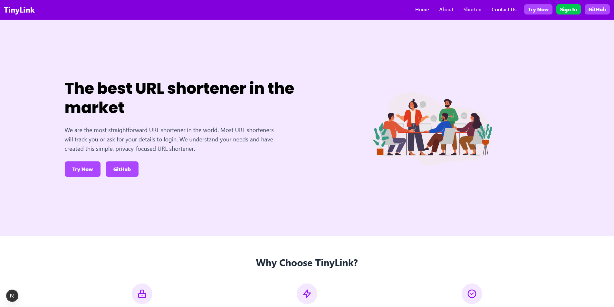
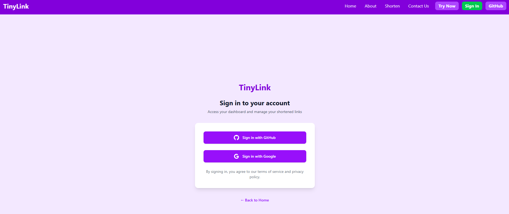
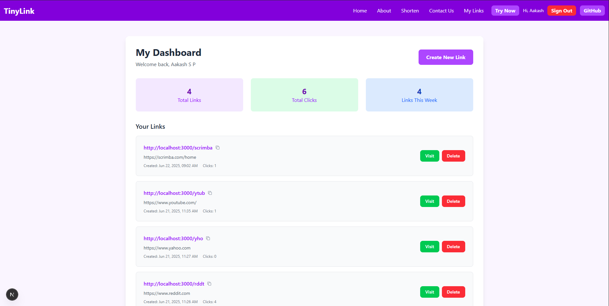
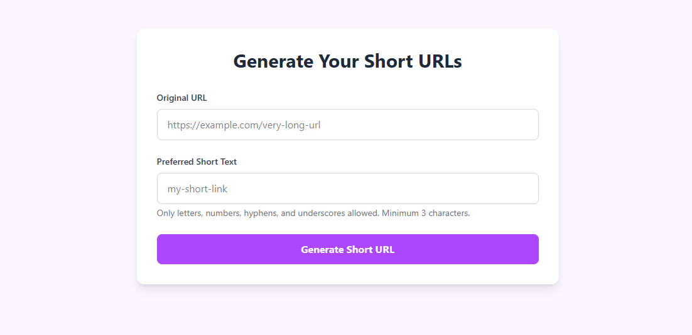

# 🔗 TinyLink - URL Shortener with Auth & Dashboard

TinyLink is a full-stack URL shortener web app built using **Next.js**, **MongoDB**, and **NextAuth.js**. It allows users to shorten long URLs, manage them via a personal dashboard, and track usage securely with authentication.

---

## 🚀 Features

- ✂️ Shorten long URLs to clean, shareable links
- 🔐 User authentication with OAuth (Google/GitHub)
- 📊 Dashboard to view your shortened links and analytics (click count, date created)
- 📌 Copy-to-clipboard functionality for easy sharing
- 🗑️ Delete your own links
- ⚙️ Secure backend using Next.js API routes with session-based protection
- 📦 Built with MongoDB

---

## 🧪 Tech Stack

- **Frontend**: React, Next.js 14 (App Router), TailwindCSS, Toastify
- **Backend**: Next.js API routes, MongoDB
- **Auth**: NextAuth.js with MongoDB Adapter

---


## 🛠️ Getting Started
Prerequisite: You must have MongoDB installed and running locally

### 1. Clone the repo
```bash
git clone https://github.com/your-username/tiny-link.git
cd tiny-link
```

### 2. Install dependencies
```bash
npm install
```

### 3. Set up environment variables

Create a `.env.local` file in the root directory and add:

```env
MONGODB_URI=your_mongodb_connection_string
NEXTAUTH_URL=http://localhost:3000
NEXTAUTH_SECRET=your_nextauth_secret
GITHUB_ID=your_github_client_id
GITHUB_SECRET=your_github_client_secret
GOOGLE_CLIENT_ID=your_google_client_id
GOOGLE_CLIENT_SECRET=your_google_client_secret
```

### 4. Run the development server

```bash
npm run dev
```

Open [http://localhost:3000](http://localhost:3000) to view it in your browser.

---

## 📸 Screenshots





---

## 📄 License

MIT License — feel free to fork and build upon it.

---

## 🙏 Credits

Built with ❤️ by [Aakash S P]

---
